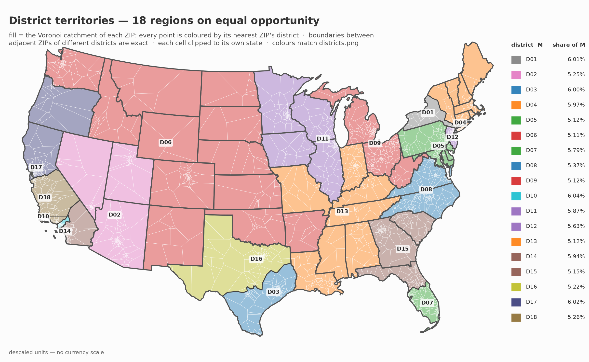
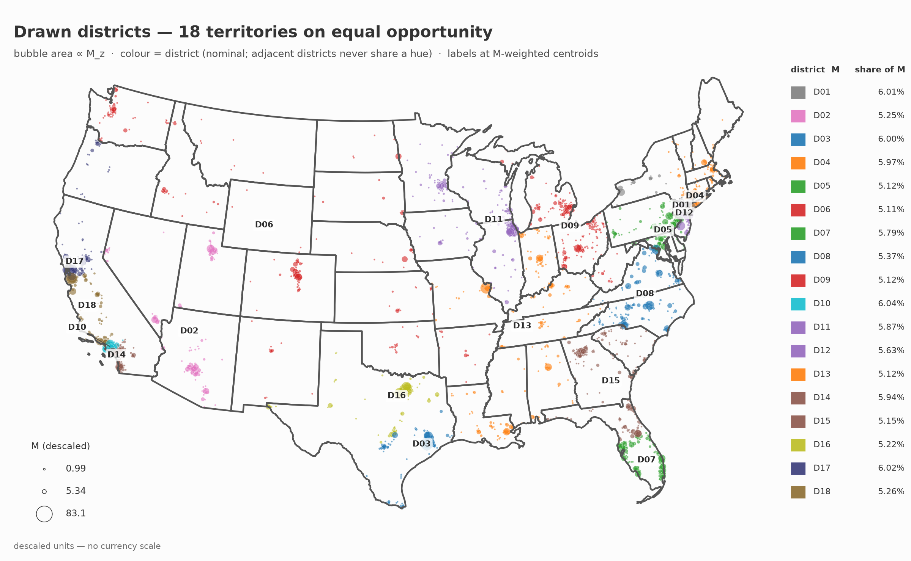

# Override: California capped at 4 districts, δ = 10%

An exploration, not a proposed map. It answers the question "what if California were held to
fewer districts, and how does the rest of the map respond".

## Why the band had to move

California carries 4.15 times a district's worth of opportunity. A state of mass $M_s$ needs at
least $\lceil M_s / ((1+\delta)\tau) \rceil$ districts, so at δ = 5% California needs 4, and
California in 3 is impossible for any arrangement of the other states. It would need a band of
about 38%.

California in 4 is legal at δ = 5% but sits exactly on that floor. Four districts at the 5% cap
hold 4.20τ against California's 4.15τ, which leaves 0.047τ of slack for every other state
across those four districts, and forces each of them into a window 4.7% of a district wide.
HiGHS found no feasible integer point in ten minutes, so the run here widens the band to 10%,
where the same four districts hold 4.40τ and the slack grows to 0.247τ.

The lesson worth carrying: the arithmetic floor is necessary, not sufficient. It rules a cap
out, it does not promise one is reachable.

## What changed

| state | headline, δ = 5% | this map, δ = 10% |
|---|---|---|
| CA | 5 | **4** |
| NY | 3 | **2** |
| NJ | 1 | **2** |
| TX | 2 | 2 |
| FL | 2 | 2 |
| **splits** | **8** | **7** |

Only California was constrained. New York fell to two districts on its own and New Jersey split
for the first time, so the pressure released in the west reappeared in the northeast. The total
number of splits fell.

California divides as D10, D14 and D18 taking 26.49% of the state each, and D17 taking 20.54%.
Each of the first three works out to 1.100τ, exactly the 10% cap, so three districts are pure
California filled to the brim and the fourth reaches into Oregon to clear its lower band.

## What it costs

| | headline | this map | committed draw |
|---|---|---|---|
| spread | 8.98% | 16.70% | 1.37% |
| max deviation | 5.25% | 8.71% | 1.00% |
| stage-2 value | 95.7879 | 95.7458 | 95.7552 |
| ZIPs moved vs committed | 776 | 1076 | 0 |

This map is worse than the headline on balance and on value. Most of that cost comes from the
wider band rather than from the California cap itself.

## Read this before quoting the map

The solve hit its 15 minute limit with a **1.79% optimality gap**, so this is a feasible
incumbent, not a certified minimum-splits map. A longer run may find 6 splits. The headline map
by contrast closed with a gap of exactly zero.

## Per-district composition

An equal share is 5.56%. Districts here run from 5.11% to 6.04%, against 5.35% to 5.85% in the
headline.

| district | share | deviation | ZIPs | states |
|---|---|---|---|---|
| D01 | 6.01% | +0.46 | 147 | NY |
| D02 | 5.25% | −0.31 | 184 | AZ, UT, NV |
| D03 | 6.00% | +0.44 | 136 | TX |
| D04 | 5.97% | +0.42 | 277 | NY, CT, MA, NH, RI |
| D05 | 5.12% | −0.44 | 220 | PA, MD, DC, DE, NJ, HI |
| D06 | 5.11% | −0.44 | 300 | CO, WA, ID, NE, AR, OK, KS, NM, ND, SD |
| D07 | 5.79% | +0.24 | 247 | FL |
| D08 | 5.37% | −0.19 | 217 | NC, VA |
| D09 | 5.12% | −0.44 | 278 | MI, OH, WV |
| D10 | 6.04% | +0.49 | 123 | CA |
| D11 | 5.87% | +0.32 | 285 | IL, MN, WI, IA |
| D12 | 5.63% | +0.07 | 171 | NJ |
| D13 | 5.12% | −0.43 | 238 | IN, LA, MO, KY, AL, TN, MS |
| D14 | 5.94% | +0.39 | 167 | CA |
| D15 | 5.15% | −0.41 | 243 | GA, FL, SC |
| D16 | 5.22% | −0.33 | 165 | TX |
| D17 | 6.02% | +0.46 | 204 | CA, OR |
| D18 | 5.26% | −0.30 | 146 | CA |

D06 becomes an interior block of ten states running from Washington and Idaho across to the
Dakotas and down to Oklahoma. Texas is no longer paired with Oklahoma and Kansas; both its
districts are now inside the state.

## Territory



## Districts and opportunity



## Reproduce

```
tools/state_splits.py instance_descaled_v2.json.gz \
  --draw battery/results/draw_k18_v2_20260904/k18/draw.csv \
  --delta 0.10 --anchor-homes --cap CA=4 --unanchor CA \
  --eta 0.01 --rounds 5 --time-limit 900 --no-maps --out <dir>
```

`--cap CA=4` is the override. `--unanchor CA` is required because five districts are anchored in
California by their representatives' home states, which alone makes a cap of 4 infeasible; it
releases only the surplus, keeping the four anchors that hold the most Californian opportunity
and dropping D02. `splits.json` in this directory is the solver's own output for the run.
